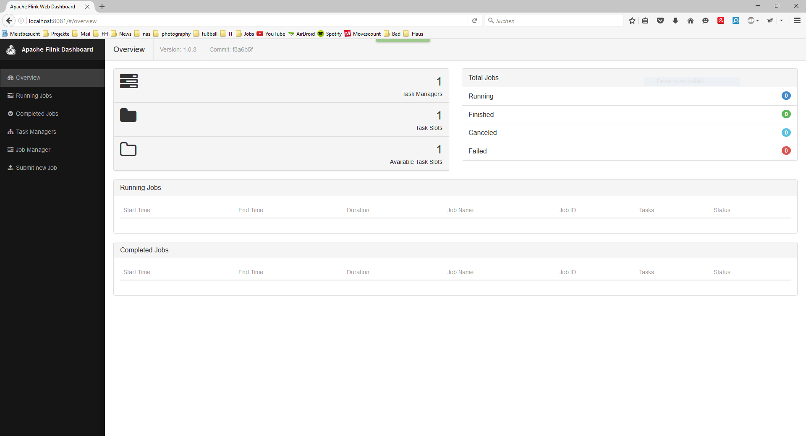
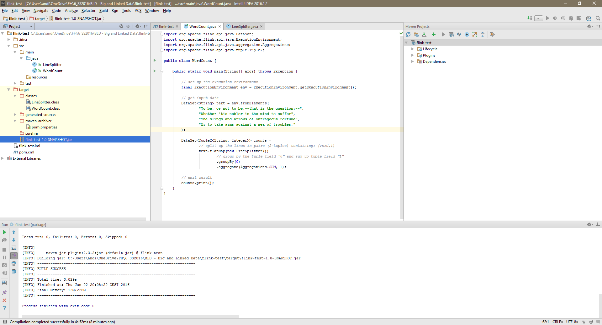
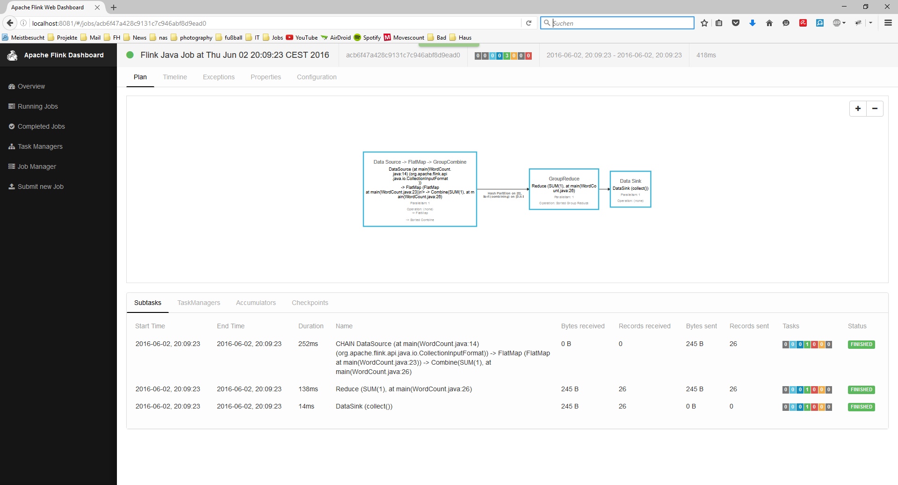
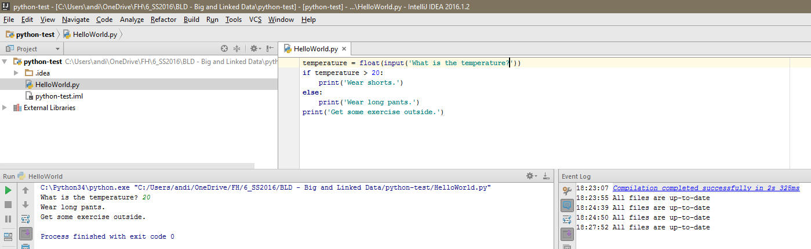

# Data Engineering
## Assignment 1: Big Data in Ihrem Umfeld
### 1.1
Schauen Sie sich in Ihrem Umfeld um. FH Technikum oder Ihr Job. Nennen Sie mindestens ein
Beispiel für Daten, die schemalos (unstrukturiert) sind und mindestens ein Bespiel für Daten, die
strukturiert (schematisch) sind.

- strukturlos: Logfiles meines Webservers
- strukturiert: Daten in der relationalen Datenbank des dazugehörigen CMS

### 1.2
Nennen Sie ein Beispiel für Daten in Ihrem Umfeld, die gestreamt verarbeitet werden, nennen Sie ein
Beispiel für Daten in Ihrem Umfeld, die über Batchverarbeitung verarbeitet werden.

Gestreamte Daten:
- Webanalytics für einen Webserver (zB Google Analytics). Sobald ein User eine Webseite besucht, werden die Daten sofort verarbeitet und sind ad-hoch für den Administrator abrufbar.

Batchverarbeitung:
- Bestellungen im Webshop werden einmal täglich verarbeitet und gesammelt an das Lager zum Versenden geschickt.

## Assignment 2: Big Data in Ihrem Umfeld
Entscheiden Sie sich für eine Data Engineering Plattform. Apache Flink oder Apache Spark.
Installieren Sie die auf Ihrem Arbeitsgerät.

- Auch wenn Spark verbreiteter ist, habe ich mich für Flink entschieden, da es neben Batchverarbeitung auch echtes Streaming unterstützt (Spark emuliert es nur durch kleine Batches).
- 
- Ich verwende die IDE  IntelliJ IDEA 2016.1.2 den Paketen jflink-core und flink-java in der Version 1.0.3. Die Pakete habe ich mit einer maven-Dependency eingebunden. 

## Assignment 3: Big Data in Ihrem Umfeld
Schreiben Sie ein simples Program mit dem Framework (z.B. Helloworld) und laden Sie es hoch.

- [flink-test-1.0-SNAPSHOT.jar](flink-test-1.0-SNAPSHOT.jar)
- den Source-Code finden sie im Verzeichnis flink-test
- 

# Data Science
## Assignment 1: Technologien
### 1.1
Sie haben in der LVA zwei Frameworks kennengelernt (R und Python). Nennen Sie zwei weitere
Technologien, um Daten zu analysieren (müssen nicht open source sein)

1. Go - von Google
2. Julia
3. Matlab - von Mathworks, kostenpflichtig

### 1.2
Sie bekommen den Auftrag, sich mit einer Data Science Technologie zu arbeiten. Nennen Sie
Technologie, die ihnen auf dem ersten Blick am besten für Sie ersscheint und begründen Sie das!

Ich würde Python wählen, da
- mehr als nur Data Science damit machen kann (universellere Sprache)
- es mir von der Syntax mehr zusagt
- meine favorisierte IDE IntelliJ es unterstützt

## Assignment 2: Technologien
Entscheiden Sie sich für eine Data Science Plattform. R oder Python
Installieren Sie die auf Ihrem Arbeitsgerät.

1. Ich habe mich für Python entschieden, da ich bereits Erfahrung damit habe und es mir von der Syntax sympathischer ist.
2. Den Source-Code finden sie im Verzeichnis python-test.
2. 
3. Als Toolchain benutze ich IntelliJ IDEA 2016.1.2 mit dem Python Plugin mit Python 3.4.0 SDK.

## Assignment 3: Big Science
Der Cheatsheet auf http://scikit-learn.org/stable/tutorial/machine_learning_map/ ist eine einfache
Anleitung, wie man den richtigen Algorithmus zum richtigen Data Science Problem findet.
Schauen Sie in Google nach und lernen Sie classificatiom, regression, clusting und dimensional
reduction unterscheiden.
Nennen Sie ein Beispiel aus ihrem Umfeld, wo Sie mit dem Algorithmus zu tun haben. Das kann ein
Beispiel sein, wie: Wenn Sie bei Amazon einkaufen. Wenn Sie von einem Marketinginstitut angerufen
werden, etc.

- Classification: Einteilung in gegebene Klassen. zB: #Hashtags auf Twitter klassifizieren den Tweet in einen Stream.
- Regression: Automatische Einteilung in vorher nicht gegebene Klassen. zB: Immobilienmarkt - Vorschlag eine Preises aufgrund von Eigenschaften des Objektes. (Lage, Größe, Baujahr,...)
- Clustering: Einteilung aufgrund von ähnlichen Merkmalen. zB: Einkauf bei Amazon: welche Produkte könnten sie noch interessieren?
- Dimensional Reduction: Automatische Reduktion von nicht benötigten/aussagekräftigen Dimensionen. zB: Automatische Erkennung in R von relevanten Dimensionen einer Umfrage.